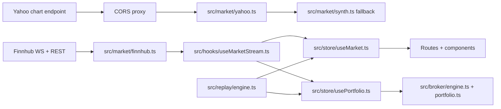

# Architecture

Reviewed on 2026-05-06. This document describes the current app shape, data flow, order lifecycle, replay flow, and operational limits.

## System Map



## Provider Boundary

`src/market/provider.ts` defines the app-facing market data interface. `src/market/finnhub.ts` is the current provider and exposes:

- `connect()` / `disconnect()` for the WebSocket lifecycle.
- `subscribe(symbol)` / `unsubscribe(symbol)` for live trade ticks.
- `onTick(handler)` for fan-out to app stores.
- REST methods for quotes, candles, profiles, fundamentals/metrics, and news.

The provider keeps a single WebSocket, tracks subscribed symbols, dedupes subscriptions, reduces Finnhub batches to the latest tick per symbol, and reconnects on close. The rest of the app talks to the provider interface instead of binding directly to Finnhub protocol details.

## Market Data Flow

Live mode:

1. Route/component subscription hooks call `useSubscribeSymbol` or `useSubscribeMany`.
2. The provider subscribes to Finnhub and seeds stale/missing quotes with REST `/quote`.
3. `useMarketStream` receives ticks, ignores them while replay is active, writes `useMarket.setTick`, and calls `usePortfolio.onTick`.
4. `usePortfolio.onTick` calls `tryFillOpenOrders` with the latest known prices.

Replay mode:

1. `ReplayDialog` starts `replayEngine` with a date, speed, and initial symbols.
2. The engine fetches 1-minute Yahoo candles for held/watchlist/subscribed symbols.
3. It emits each candle close as a replay tick through `useMarket.setReplayTick`.
4. It calls `usePortfolio.onTick(prices, simNow)` so fills and trade history use the simulated timestamp.
5. Live WebSocket ticks are gated until replay stops.

Yahoo chart fetches use a configurable CORS proxy. If Yahoo or the proxy fails, `src/routes/ticker.tsx` uses deterministic synthetic candles and shows a synthetic-data badge.

## Order Lifecycle

Order logic is pure and lives in `src/broker/engine.ts`; portfolio mutation happens only when the Zustand store accepts the returned snapshot.

`placeOrder(portfolio, input, lastPrice, now)` validates:

- Symbol presence.
- Positive finite quantity.
- Positive finite live price.
- Required limit/stop prices by order type.
- Cash for buys and shares for sells.
- Time-in-force behavior for DAY, GTC, IOC, and FOK.

Fill behavior:

- Market orders fill immediately at last price plus or minus 2 bps of simulated slippage.
- Marketable buy limits fill at `min(last, limit)`.
- Marketable sell limits fill at `max(last, limit)`.
- Resting limits and triggered stop-limits use the same better-price rule in `tryFillOpenOrders`.
- Stop-market orders trigger when the stop condition crosses and then fill with market slippage.
- DAY orders expire on the next calendar day.

`now` is threaded through placement and fill calls so live mode uses wall-clock time and replay mode uses simulated market time.

## State Stores

| Store | Persisted | Purpose |
|---|---:|---|
| `useMarket` | No | Current quote map, quote seeding, live ticks, replay ticks. |
| `usePortfolio` | Yes | Cash, positions, history, open orders, broker integration. |
| `useWatchlist` | Yes | Editable symbol list. |
| `useEquityHistory` | Yes | Daily equity snapshots and synthetic seed curve. |
| `useReplay` | No | Replay mode, speed, simulated clock, and errors. |

Persisted state is local to the browser. There is no backend account or broker integration.

## Routing And Deploy

The app uses `HashRouter`. URLs look like `/#/ticker/AAPL`, which avoids GitHub Pages 404s for deep links.

`vite.config.ts` reads `BASE_PATH` for static asset paths. Local development defaults to `/`; the GitHub Pages workflow sets it to `/StockTrader/`. The PWA manifest uses relative `start_url` and `scope`, and the SVG favicon is the only manifest icon today.

## Testing

Current baseline: 10 test files, 77 passing tests.

| File | Coverage |
|---|---|
| `src/broker/engine.test.ts` | Market fills, slippage, limit/stop/stop-limit behavior, TIF handling, insufficient cash/shares, open-order fills. |
| `src/components/stats-panel-model.test.ts` | Expanded research-stat grouping, unavailable-value formatting, and volume-relative calculations. |
| `src/market/fundamentals.test.ts` | Finnhub metric mapping for legacy quote-header fields and richer fundamentals. |
| `src/market/ranges.test.ts` | Range-to-resolution and lookback mapping. |
| `src/market/synth.test.ts` | Synthetic candle determinism and OHLC invariants. |
| `src/market/yahoo.test.ts` | Yahoo response parsing and malformed/empty data handling. |
| `src/routes/transact-helpers.test.ts` | Trade-universe construction and selected-symbol reconciliation. |
| `src/utils/et-bounds.test.ts` | US Eastern market bounds in EDT and EST. |
| `src/utils/indicators.test.ts` | SMA window math and edge cases. |
| `src/utils/stats.test.ts` | Drawdown and realized P/L statistics. |

Recommended verification for documentation-only changes:

```bash
npm.cmd test
npm.cmd run typecheck
npm.cmd audit --json
npm.cmd run build
$env:BASE_PATH='/StockTrader/'; npm.cmd run build
```

## Current Limits

- Historical chart and replay data depend on Yahoo's undocumented endpoint and a proxy.
- Public CORS proxies can rate-limit or fail; use the Cloudflare Worker for reliable demos.
- Free Finnhub keys are rate-limited and embedded in the public client bundle.
- There is one provider singleton, which is fine for a local demo but not a multi-tenant service.
- Replay state is intentionally transient and resets to live mode on reload.
- Automated component/browser smoke coverage is still missing; see `docs/BUGS.md` and `docs/UX_UI_REVIEW.md`.
- `npm audit --json` is currently clean on the reviewed dependency set.
